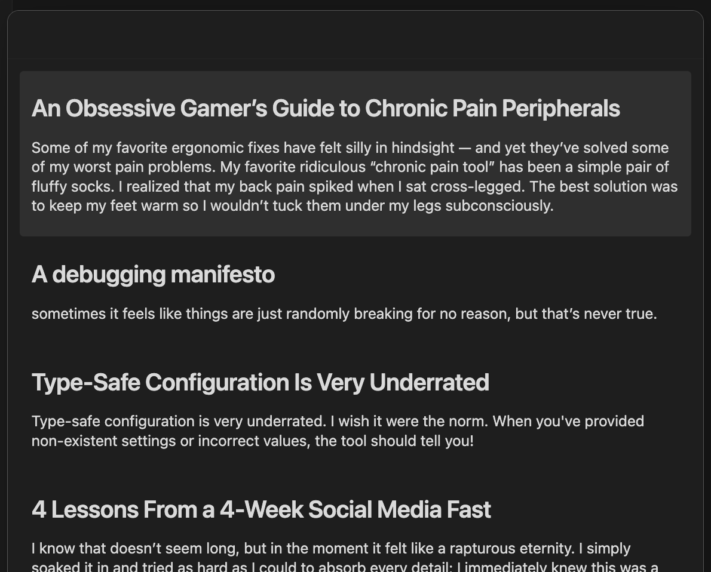

# Readwise daily reviews, now in Obsidian

This is a _beta_ plugin adding features to the Readwise x Obsidian integration.

## Motivation
I use both Readwise (https://readwise.io/) and Obsidian (https://obsidian.md) regularly.
When reviewing my daily highlights in Readwise, I'd sometimes want to connect the highlight to something in my Obsidian vault.

Since my vault already has all of my Readwise highlights—and since I personally have each highlight exported as one block (a callout)—this plugin is mostly a matter of finding the block corresponding to some highlight.

## How it works
_This requires a paid subscription to Readwise._

The plugin assumes that the official [Readwise integration for Obsidian](https://github.com/readwiseio/obsidian-readwise) is installed.
We use the official plugin's data for both (1) your Readwise API token and (2) the filename to book ID mapping.

We register a new command, "Add daily review highlights to current note."
This gets your Readwise daily review [from the API](https://readwise.io/api_deets#review), attempts to locate each highlight in the vault, and presents them in a modal.

## Sharp edges
We read your Readwise API token from the official plugin's data.
I don't know whether this is explicitly forbidden—the [developer policy](https://docs.obsidian.md/Developer+policies) makes no mention of this—but it's at _minimum_ questionable (and undocumented).
That said, I built the plugin for my personal use; the plugin makes no attempt to hide this; the command is gated by a user action; and we only make read/GET requests.

Since the request volume is so low and the user is fully in-control, we don't make any attempt to cache responses or rate limit the requests.

The plugin assumes that highlights are stored and formatted the way that my vault stores and formats them.
Specifically:

- Each highlight is wrapped in a callout
- The callout has a block reference ID, the string `rw` plus the highlight ID (e.g., `rw0041401448`)
- You use `[[Markdown links]]` and not `[wiki](links)`.

The plugin will ignore (silently or gracefully, depending on your perspective) highlights that it can't find (because the file was deleted, because there are multiple files with the book's name, etc.).

## Tools and development
This project uses:

- [bun](https://bun.sh/) as a package manager
- [vite](https://vitejs.dev/) as a bundler (because bun doesn't support CJS bundling)
- [biome](https://biomejs.dev/) for linting and formatting
- [hot-reload](https://github.com/pjeby/hot-reload) for simpler development

To develop the project:

- Clone this repo.
- Install [bun](https://bun.sh/), if needed.
- Install dependencies with `bun install`.
- Start the development server with `bun dev`.
- Format and lint (with autofixes) with `bun fix`.

The build process generates main.js and places it in the root of the repo.
I commit this file to Github for simplicity.

To create a release:

- Increment the version: `bun version <name>`, where the name is e.g., `1.0.0-beta4`.
- Commit the (now-changed) package.json and manifest.json files.
- Create a new tag with the same name: `git tag -a <name> -m <name>`
- Push the commit(s) & tag.

In response to pushing the tag, Github Actions will create a new release that includes the main.js & manifest.json files..

## Releases
I have created beta releases to support installation with the excellent, community-maintained [BRAT](https://github.com/TfTHacker/obsidian42-brat).
I don't plan to submit this as an official plugin unless there is interest from not-just-me.

Issues, PRs, and discussions are welcome.
If you like this, please let me know!
